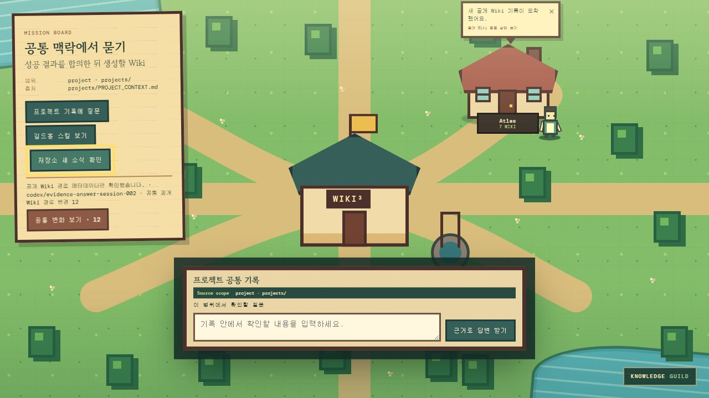

<div align="center">

# Knowledge Guild RPG

### **Build a living Wiki. See its work as a guild.**

프로젝트의 지식을 대화로 설계하고, 실제 Markdown Wiki로 만들며, 그 진행을 따뜻한 픽셀 길드에서 보는 로컬 우선 도구입니다.




*실제 앱 UI로 촬영한 demo village입니다. 데모 캐릭터는 개인 기록이나 실제 사람을 뜻하지 않습니다.*

</div>

## 이 프로젝트가 무엇인가

Knowledge Guild RPG는 짧은 자유 입력을 바탕으로 프로젝트에 맞는 Wiki 구조를 제안하고, 승인 뒤에만 로컬 Markdown 파일을 만드는 **Wiki Architect**입니다. 같은 핵심 로직은 명령줄과 로컬 API에서 실행되고, 픽셀 마을은 그 실제 상태를 보여 주고 조작하는 화면입니다. 이미 만든 Wiki에서는 허용된 근거 범위 안에서만 답하는 길드 질문 기능을 제공합니다.

## 핵심 그림

```text
Headless Wiki Architect / Core
  ├─ 프로젝트 해석 · clarification · blueprint 검증 · 승인 적용 · 파일 계획
  ├─ 구조화 이벤트(JSONL): session.started, blueprint.proposed, files.written …
  ↓
CLI / local API
  ├─ 터미널, 자동화, 로컬 서버가 같은 core를 호출
  ↓
React pixel UI projection
  └─ 길드홀·캐릭터·말풍선은 실제 이벤트와 저장된 Wiki 상태를 표현
```

즉, **CLI에서 움직이는 Wiki 하네스를 픽셀 길드로 봅니다.** 브라우저가 Wiki 파일을 직접 읽거나 쓰는 척하지 않으며, 애니메이션이 작업 완료를 만들어 내지도 않습니다.

## 지금 할 수 있는 것

- 한 문장의 자유 입력을 해석해, 프로젝트별 Wiki blueprint와 파일 계획을 제안합니다.
- 정보가 정말 부족할 때만 clarification을 한 번에 하나씩, 최대 두 번 제안합니다.
- 승인 전에는 파일을 쓰지 않고, 승인 뒤에는 local writable mode에서 안전한 경로만 원자적으로 생성합니다.
- `raw/`(원본), 컴파일된 `wiki/`, `output/`(결과물), index/log를 분리한 구조를 만듭니다.
- 프로젝트 공통 기록 또는 한 멤버의 허용된 Wiki 기록에 질문하고, 인용·신뢰도·한계·모드를 함께 확인합니다.
- 픽셀 마을에서 프로젝트 길드홀과 멤버별 Wiki 공간을 볼 수 있습니다.

## 3분 시작하기

### 1) 준비물

Node.js **18 이상**이 필요합니다. 이 저장소의 Vite 5 의존성은 `^18.0.0 || >=20.0.0`을 요구하며, 현재는 Node 24에서도 확인했습니다. Git도 설치되어 있으면 clone이 편합니다.

### 2) 내려받고 실행하기

```sh
git clone <YOUR-REPOSITORY-URL>
cd Knowledge-Guild-RPG/apps/wiki-village
npm ci
npm run dev -- --host 0.0.0.0
```

터미널에 나온 `http://localhost:5173`은 **내 컴퓨터에서만** 여는 주소입니다. 같은 Wi-Fi의 다른 기기에서 보려면 `http://내-LAN-IP:5173`을 사용합니다. LAN에서는 분석과 파일 계획 미리보기까지만 가능하고, 실제 저장은 이 컴퓨터의 `localhost` 또는 CLI에서만 허용됩니다. 화면은 처음부터 이 제한을 표시합니다.

AI provider는 선택 사항입니다. 사용하려면 `apps/wiki-village/.env.example`을 참고해 같은 폴더에 `.env`를 만들고 서버 전용 키를 넣습니다. `.env`와 API 키는 커밋하지 말고 `VITE_` 접두사에도 넣지 마세요. Architect는 항상 `mode`, `providerStatus`, 안전한 diagnostic을 표시합니다. 키 없음(`not-configured`), 응답 형식 오류(`malformed-response`), 네트워크 오류(`unavailable`), 기타 provider 실패(`failed`)는 **local draft**로 분명히 구분됩니다. 비용이 드는 연결 점검은 `KNOWLEDGE_GUILD_PROVIDER_SMOKE=1`과 키를 함께 설정한 뒤에만 `npm run test:provider-smoke`로 실행합니다.

## 첫 Wiki 만들기

처음 열면 완성된 마을 대신 Wiki Architect 안내 화면이 보입니다.

1. “무엇을 만들거나 해결하려고 하나요?”에 떠오르는 대로 적습니다.
2. Architect가 의도, 알려진 사실·가정·미지점, 추천 pipeline/page type을 해석합니다.
3. 정말 필요한 정보가 있을 때만 clarification을 묻습니다. 충분하면 바로 다음 단계로 갑니다.
4. **내가 이렇게 이해했다** 요약과 **이 구조로 Wiki를 만들겠다** blueprint를 고칩니다.
5. 표시 이름과 `member-id`를 한 번 확인합니다.
6. 생성될 파일 목록을 미리 보고 승인합니다.

승인 뒤에만 `projects/`와 해당 `members/{member-id}/`에 scaffold가 생성됩니다. 이후 프로젝트 길드홀과 그 멤버의 캐릭터가 마을에 나타납니다.

## CLI 사용법

CLI도 화면과 같은 core를 사용합니다. 아래 명령은 `apps/wiki-village` 폴더에서 실행합니다. 모든 출력은 자동화에 쓰기 쉬운 JSONL(한 줄에 JSON 하나)입니다.

### analyze — 자유 입력 해석

PowerShell:

```powershell
'{"statement":"동네 카페의 고객 피드백을 모아 메뉴 개선 가설을 검증하고 싶다."}' | node scripts/wiki-architect-cli.mjs --command analyze
```

macOS/Linux 등의 일반 shell:

```sh
printf '%s\n' '{"statement":"동네 카페의 고객 피드백을 모아 메뉴 개선 가설을 검증하고 싶다."}' | node scripts/wiki-architect-cli.mjs --command analyze
```

PowerShell은 작은따옴표 안의 JSON을 그대로 전달할 수 있고, 일반 shell은 `printf`를 쓰면 줄바꿈을 명확히 보낼 수 있습니다. 결과의 `result.blueprint`를 다음 요청의 `blueprint`에 사용하세요.

### preview — 승인 전 파일 계획 보기

아래는 방금 `analyze`한 실제 blueprint를 `preview.json`으로 만들고, 쓰지 않을 파일 계획을 보는 PowerShell 예시입니다. `memberId`와 표시 이름은 본인이 확인한 값으로 바꾸세요.

```powershell
$events = '{"statement":"동네 카페의 고객 피드백을 모아 메뉴 개선 가설을 검증하고 싶다."}' |
  node scripts/wiki-architect-cli.mjs --command analyze |
  ForEach-Object { $_ | ConvertFrom-Json }
$blueprint = ($events | Where-Object { $_.type -eq 'result' }).result.blueprint
$previewRequest = @{ blueprint = $blueprint; identity = @{ memberId = 'demo-author'; displayName = 'Demo Author'; workingContext = '초안 검토' } }
$previewRequest | ConvertTo-Json -Depth 12 | Set-Content .\preview.json -Encoding utf8
node scripts/wiki-architect-cli.mjs --command preview --input .\preview.json
```

`preview` 결과의 `result.preview.digest`는 다음 저장 요청에 반드시 일치해야 하는 확인값입니다. 파일을 아직 만들지 않습니다.

### save — 승인된 계획 적용

다음은 preview digest를 넣어 승인된 계획을 새 로컬 폴더에 적용하는 실제 PowerShell 예시입니다. `$localRoot`는 **쓰기 허용한 폴더**로 바꾸세요.

```powershell
$previewEvents = node scripts/wiki-architect-cli.mjs --command preview --input .\preview.json |
  ForEach-Object { $_ | ConvertFrom-Json }
$digest = ($previewEvents | Where-Object { $_.type -eq 'result' }).result.preview.digest
$saveRequest = $previewRequest.Clone()
$saveRequest.expectedDigest = $digest
$saveRequest | ConvertTo-Json -Depth 12 | Set-Content .\save.json -Encoding utf8
$localRoot = Join-Path $HOME 'knowledge-guild-cli-demo'
node scripts/wiki-architect-cli.mjs --command save --repo-root $localRoot --input .\save.json
```

digest가 다르거나 기존 파일과 충돌하면 저장하지 않습니다. 경로 이동(`..`), 예약된 private/secrets 경로, 허용하지 않은 경로도 거부합니다.

### status — 현재 scaffold 상태 확인

```powershell
'{}' | node scripts/wiki-architect-cli.mjs --command status --repo-root $localRoot
```

```sh
printf '%s\n' '{}' | node scripts/wiki-architect-cli.mjs --command status
```

## 생성되는 구조

모든 프로젝트에 똑같은 지식 분류를 강요하지 않습니다. 공통 골격만 안전하게 유지하고, blueprint가 목적에 맞는 page type과 routing을 정합니다.

```text
projects/
  PROJECT_CONTEXT.md       # 승인된 공통 brief
  WIKI_BLUEPRINT.md        # 왜 이 구조인지, page type/routing/harness
  index/ · log/            # 공통 색인과 기록
members/<member-id>/
  CONTEXT.md               # 이 멤버가 확인한 최소 맥락
  raw/                     # 불변 원본을 둘 계층
  wiki/                    # AI가 컴파일해 유지할 Wiki 계층
  output/                  # Wiki에서 만든 별도 결과물
  index/ · log/            # 멤버 범위 색인과 기록
  harnesses/               # 선택된 ingest/query/lint/reflect SKILL.md scaffold
```

예를 들어 기술 학습은 `기술 / 판단 / 레시피 / 사례`, 시장 조사는 `기업 / 시장 / 가설 / 신호 / 결론`, 창작은 `세계관 / 캐릭터 / 플롯 / 자료 / 산출물`처럼 달라질 수 있습니다. 이는 예시일 뿐이며, 실제 page type은 프로젝트 입력과 승인한 blueprint가 결정합니다.

## 캐릭터와 길드 UI가 뜻하는 것

중앙 **프로젝트 길드홀**은 `projects/`의 공통 맥락만 나타냅니다. 각 **캐릭터와 집**은 오직 해당 `members/{member-id}/`의 개인 Wiki 범위만 나타냅니다. 개인 관점은 자동으로 공통 사실이나 공식 결정이 되지 않습니다.

캐릭터의 포즈, 말풍선, 활동처럼 보이는 연출은 작업 이벤트를 읽기 쉽게 표시하는 중립적인 visual state입니다. 실제 사람의 상태, 의도, 온라인 여부, 가용성을 주장하지 않습니다.

## 보안과 데이터 경계

- `.env`, API 키, `raw/`, `output/`, private profile/context, secrets는 브라우저 snapshot과 커밋 대상에서 제외합니다.
- 사용자의 원문, AI 제안, 승인된 blueprint를 구분합니다. 승인 전에는 canonical 파일을 만들지 않습니다.
- local writable mode만 실제 repository 쓰기를 수행합니다. Vercel 같은 read-only 배포는 preview/export 화면일 뿐, 저장됐다고 말하지 않습니다.
- member-id는 소문자·숫자·하이픈만 허용하며, 다른 멤버 공간이나 저장소 밖 경로로 쓰는 요청은 거부합니다.
- 근거 기반 답변은 선택한 project/member scope와 citation allowlist 밖의 기록을 섞지 않습니다.

## 테스트 명령

`apps/wiki-village`에서 실행합니다.

```sh
npm run test:snapshot
npm run test:chat
npm run test:onboarding
npm run test:provider-smoke # key + explicit opt-in 없으면 SKIP
npm run test:deploy
npm run test:layout
npm run test:guild
npm run build
```

snapshot·chat·onboarding 검사는 scope, citation, local draft, 입력 검증, scaffold 충돌 같은 계약을 확인합니다. `npm run build`는 production 번들을 만듭니다.

## 현재 한계와 다음 작업

- 실제 provider key를 넣은 end-to-end round trip은 아직 검증하지 않았습니다.
- LAN URL에서는 의도적으로 분석·미리보기만 지원하며, 저장은 localhost/CLI로 제한합니다.
- `ingest / query / lint / reflect`는 blueprint가 선택할 수 있는 scaffold/hook이며, 아직 실행 엔진은 아닙니다.
- CLI 이벤트는 현재 동기 응답 JSONL입니다. 실시간 session stream과 replay는 후속 작업입니다.
- 픽셀 캐릭터를 눌러 대화하는 기능과 guild news의 Git 변경 확인 UI는 후속 작업입니다.
- GitHub 새 소식은 아직 기능이 아닙니다. 향후에는 **버튼 → `git fetch` → last-seen SHA 비교 → 허용된 Wiki path 분석 → 캐릭터 알림** 순서로 설계하며, 자동 `pull`은 하지 않습니다.

## 기여 방법과 라이선스

버그나 제안은 issue 또는 변경 목적과 테스트 결과가 담긴 pull request로 알려 주세요. 개인 자료는 member 공간에만 두고, 다른 사람의 member space와 raw/private/secrets는 읽거나 추가하지 않는 규칙을 지켜 주세요.

아직 `LICENSE`를 선택하지 않았습니다. 따라서 이 저장소의 코드를 자유롭게 재사용·재배포할 수 있다고 주장하지 않습니다. 공개 배포 전에 프로젝트 소유자가 적절한 라이선스를 결정해야 합니다.
